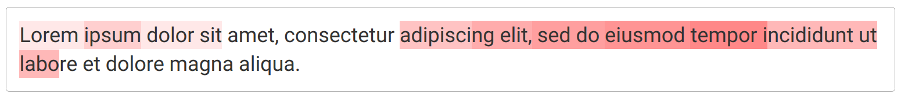
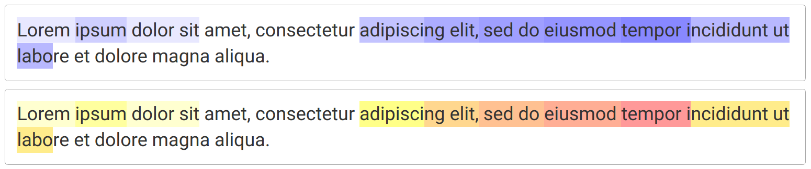

# textheat

Textbox and heatmap in one React component


## Description

`TextHeat` is a component for React that displays text, color-coded using numeric weights. 

The default styling uses a color scale with shades of red, e.g.



The scheme can be changed to other colors, e.g.



The weights (colors) of the `TextHeat` box can be adjusted using an API. The box can also be editable. These features are demonstrated in the 'examples' app.


## Setup

To get started, install dependencies and build the component.

```
npm install
npm run build
```

Run the examples app.

```
npm run examples_start
```


## Comments, questions, issues

Feedback is very welcome. Please raise an issue in the github repo. 
